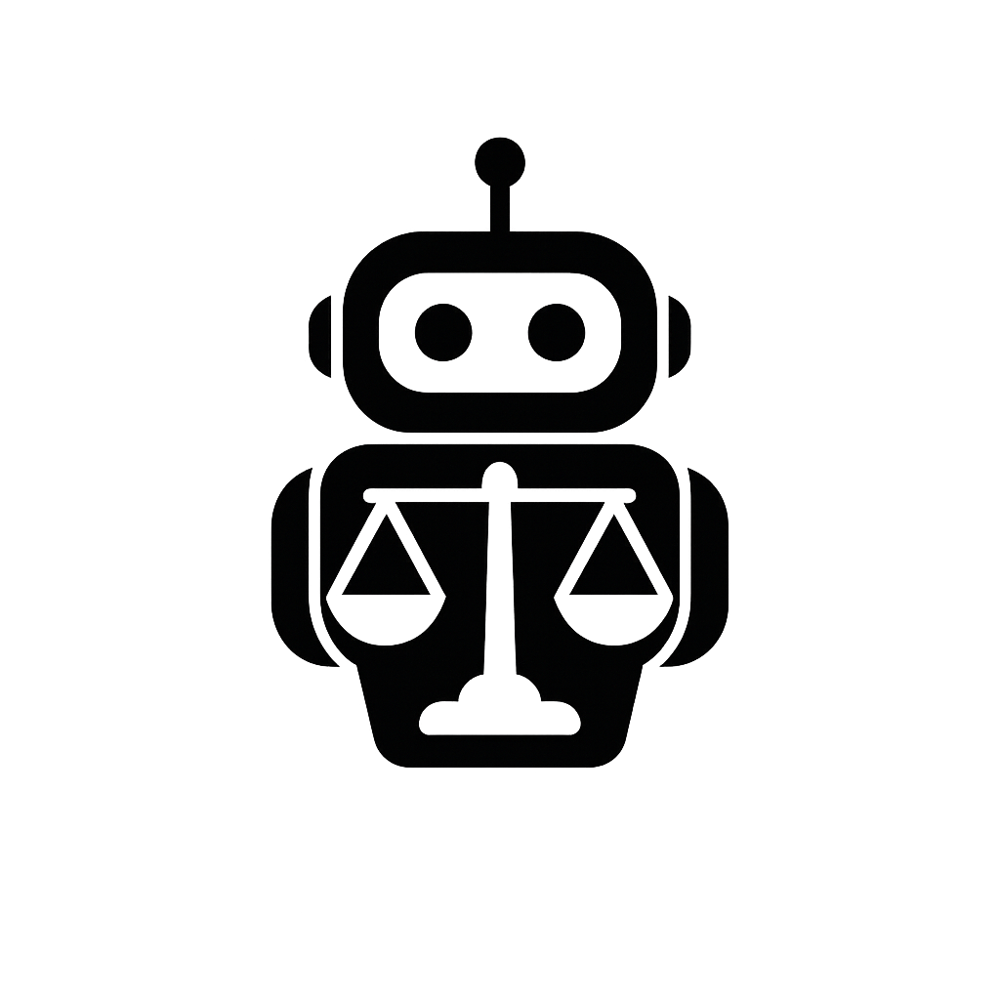

<div align="justify">

# ⚖️ AdvogaBot


<div align="center">
  
</div>

**AdvogaBot** é um chatbot jurídico impulsionado por Inteligência Artificial que aplica RAG (Retrieval-Augmented Generation) para fornecer respostas precisas a partir de documentos legais hospedados na AWS.

## 🤖 URL do ChatBot
[Advoga Assistant Bot](https://t.me/AdvogaAssistantBot)

## 📚 Documentações Relacionadas
#### Confira abaixo os outros dois READMEs do projeto para entender melhor a estrutura e funcionamento dos módulos:

- [📦 Infraestrutura (Terraform, AWS e Docker)](./terraform/README.md) - Detalhes sobre Terraform, AWS e Docker
- [🤖 Chatbot (LangChain + FastAPI + Telegram)](./bot_telegram/README.md) - Integração com LangChain, FastAPI e Telegram

## 📑 Índice

1. [URL do ChatBot](#url-do-chatbot)  
2. [Documentações Relacionadas](#documentacoes-relacionadas)
3. [Finalidade do Chatbot](#finalidade-do-chatbot)  
4. [Tecnologias Utilizadas](#tecnologias-utilizadas)    
5. [Estrutura de Pastas](#estrutura-de-pastas)  
6. [Metodologia Utilizada](#metodologia-utilizada)  
7. [Time de Desenvolvimento](#time-de-desenvolvimento)  
8. [Dificuldades Enfrentadas](#dificuldades-enfrentadas)  
---

## 🎯 Finalidade do Chatbot

> O AdvogaBot foi desenvolvido para atender às necessidades de escritórios de advocacia que desejam oferecer um canal automatizado e inteligente de atendimento aos seus clientes.

> A aplicação permite que usuários consultem, via Telegram, informações extraídas de documentos jurídicos hospedados na AWS S3, utilizando técnicas de Geração Aumentada por Recuperação (RAG) com LangChain e Amazon Bedrock.

> Dessa forma, o bot responde perguntas sobre processos, decisões e petições jurídicas de forma contextualizada e precisa — reduzindo a demanda por atendimentos manuais e tornando a comunicação com o cliente mais ágil, clara e segura.

## 🛠️ Tecnologias Utilizadas

- **Python 3.12** – Linguagem principal
- **FastAPI** – Framework para API REST
- **LangChain** – Framework de orquestração RAG
- **Amazon Bedrock** – Geração de embeddings
- **Amazon S3** – Armazenamento dos documentos jurídicos
- **Amazon EC2** – Hospedagem da aplicação
- **Amazon Cloudwatch** – Monitoramento dos loggings
- **ChromaDB** – Banco de dados vetorial local
- **Docker e Docker Compose** – Containerização do ambiente
- **Terraform** – Provisionamento da infraestrutura AWS
- **Telegram Bot API** – Interface com o usuário

## 📂 Estrutura de Pastas 

```
📦 sprints-7-8-pb-aws-janeiro/
├── 📁 .github/                        # Configurações de CI/CD com GitHub Actions
│   └── workflows/
│       └── deploy.yml                 # Workflow para deploy automatizado
│
├── 📁 assets/                        # Imagens e recursos estáticos para os READMEs
│
├── 📁 bot_telegram/                  # Bot Telegram com integração à FastAPI
│   ├── 📁 src/
│   │   ├── 📁 handlers/              # Lógica dos comandos e mensagens do bot
│   │   │   ├── __init__.py
│   │   │   └── bot_handlers.py
│   │   ├── 📁 logger/                # Sistema de logging customizado
│   │   │   └── __init__.py
│   │   ├── 🔧 config.py              # Configurações globais do bot
│   │   ├── 🤖 bot.py                 # Arquivo principal que inicia o bot
│   │   └── __init__.py
│   ├── 🧪 requirements.txt           # Dependências específicas do bot
│   ├── 📄 README.md                  # Instruções de uso do bot
│   └── 🐍 venv/                      # Ambiente virtual Python
│
├── 📁 chat/                          # API FastAPI para comunicação com o modelo
│   ├── 🧠 rag_juridico/              # Base de embeddings + ChromaDB
│   │   └── chroma.sqlite3             # Arquivo local do banco vetorial
│   ├── 🧪 teste_chroma/              # Testes com a base do Chroma
│   │   └── chroma.sqlite3
│   ├── 🤖 chatbot.py                 # Endpoint da API que responde perguntas
│   ├── 🧪 requirements.txt           # Dependências da API
│   └── 🐍 venv/
│
├── 📁 dataset/                       # Pasta para arquivos PDF jurídicos originais
│
├── 📁 docker/                        # Infraestrutura Docker
│   ├── 🐳 docker-compose.yml         # Orquestração do ambiente
│   ├── 🐋 Dockerfile                 # Imagem do app
│   └── 📦 requirements.txt           # Dependências containerizadas
│
├── 📁 rag_juridico/                  # Scripts de ingestão de documentos
│   ├── 📂 dataset/                   # Entrada para os arquivos a serem processados
│   ├── 🧪 teste_chroma/              # Testes de leitura e embeddings
│   ├── 📄 ingest.py                  # Geração de embeddings e upload
│   ├── 📄 ler_pdfs.py                # Leitura dos PDFs
│   └── 📦 requirements.txt           # Dependências para geração de embeddings
│
├── 📁 scripts/                       # Scripts de automação
│   ├── 🚀 script_inicial_ec2.sh      # Inicialização da EC2
│   └── ☁️ upload_to_s3.py            # Envio de arquivos para o S3
│   └── 🐍 venv/
│
├── 📁 terraform/                     # Infraestrutura como código (AWS)
│   └── ...                    
│
├── 🔐 .env                           # Variáveis de ambiente (não versionar)
├── 📄 .gitignore                     # Arquivos ignorados pelo Git
├── 📄 README.md                      # README principal com visão geral
└── 📄 requirements.txt               # Dependências do projeto raiz 
├── 🐳 docker-compose.yml             # Orquestração dos serviços do projeto
└── 🐋 Dockerfile
```
## 📌 Metodologia Utilizada

- A equipe utilizou a metodologia Scrum, dividida em duas sprints principais:

- Sprint 1: Planejamento e definição dos requisitos

- Sprint 2: Desenvolvimento e entrega do projeto

#### As ferramentas de comunicação e organização utilizadas foram:

- Trello – https://trello.com/b/wr4BVDeD/grupo-02

- WhatsApp e Microsoft Teams para reuniões e alinhamentos

## 👥 Time de Desenvolvimento

<div align="center">

<table style="width:90%; border-collapse: collapse;">
  <tr>
    <td align="center" style="padding: 25px; border: 1px solid #ddd;">
      <br>
      <strong>Amanda Ximenes</strong><br>
      <em>Infraestrutura, Docker e EC2</em><br><br>
      <a href="https://github.com/AmandaCampoos" target="_blank" title="GitHub de Amanda">
        
      </a>
      <a href="https://linkedin.com/in/amanda-ximenes-a02ab8266" target="_blank" title="LinkedIn de Amanda">
        
      </a>
    </td>
    <td align="center" style="padding: 25px; border: 1px solid #ddd;">
      <br>
      <strong>José Carlos</strong><br>
      <em>Processamento de Dados e Geração dos Embeddings</em><br><br>
      <a href="https://github.com/josecarlosjccf" target="_blank" title="GitHub de José">
        
      </a>
      <a href="https://www.linkedin.com/in/jos%C3%A9-carlos-candido-73b723235" target="_blank" title="LinkedIn de José">
        
      </a>
    </td>
  </tr>
  <tr>
    <td align="center" style="padding: 25px; border: 1px solid #ddd;">
      <br>
      <strong>Carlos Eduardo</strong><br>
      <em>Implementação do Chatbot (LangChain + RAG)</em><br><br>
      <a href="https://github.com/CarlosEduardo-067" target="_blank" title="GitHub de Carlos">
        
      </a>
      <a href="https://www.linkedin.com/in/carlos-eduardo-dos-santos-vital-9335612b1" target="_blank" title="LinkedIn de Carlos">
        
      </a>
    </td>
    <td align="center" style="padding: 25px; border: 1px solid #ddd;">
      <br>
      <strong>Roberta Oliveira</strong><br>
      <em>Interface com o Telegram, Cloudwatch e README</em><br>
      <br>
      <a href="https://github.com/RobertakOliveira" target="_blank" title="GitHub de Roberta">
        
      </a>
      <a href="https://linkedin.com/in/roberta-oliveira-b9a0961a4" target="_blank" title="LinkedIn de Roberta">
        
      </a>
    </td>
  </tr>
</table>

</div>

## ⚠️ Dificuldades Enfrentadas

> **🔐 Token de autenticação inválido**  
> Durante os testes iniciais, o uso de tokens expirados ou incorretos do Telegram resultava em erros `Unauthorized`, impedindo a inicialização do bot. Foi necessário atualizar o token e garantir seu correto carregamento a partir do arquivo `.env`.

> **🧠 Respostas imprecisas ou genéricas**  
> O chatbot inicialmente apresentava respostas pouco relevantes às perguntas jurídicas. A solução envolveu ajustes no prompt enviado ao modelo, definição de limiares de similaridade para os embeddings e refinamento dos parâmetros como `score_threshold` e `temperature`.

> **🔗 Dependência entre bot e API FastAPI**  
> O funcionamento do bot dependia diretamente da API FastAPI estar em execução. Isso exigiu atenção especial à ordem de inicialização dos serviços e validação do endpoint de consulta (`/query`), para garantir que a comunicação entre bot e backend ocorresse sem erros.

> **🖥️ Desafios na execução da aplicação na EC2**  
> Durante a implantação da aplicação na instância EC2, surgiram obstáculos relacionados à exposição dos serviços em portas públicas, configuração de variáveis de ambiente e permissões de acesso.


</div>

