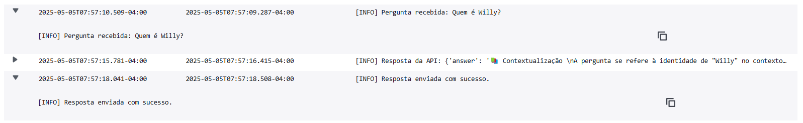

<div align="justify">

# ⚖️ AdvogaBot - ChatBot Jurídico 


<p align="center">
  
</p>

O **AdvogaBot** é um chatbot jurídico que utiliza técnicas de RAG (Retrieval-Augmented Generation) para responder perguntas com base em documentos legais armazenados no AWS S3. Ele recebe mensagens via Telegram, encaminha à API FastAPI com LangChain + Bedrock e retorna respostas fundamentadas.

</div>

## 📖 Índice

1. [Visão Geral](#visão-geral)  
2. [Tecnologias Utilizadas](#tecnologias-utilizadas)  
3. [Pré-requisitos](#pré-requisitos)  
4. [Criação do Bot no Telegram](#criação-do-bot-no-telegram)  
5. [Instalação e Execução](#como-executar)  
6. [Configuração](#configuração)  
7. [Comandos do BotFather](#comandos-úteis-do-botfather)  
8. [Logs com CloudWatch](#logs-com-cloudwatch)

## 🔍 Visão Geral

O AdvogaBot:

- Recebe mensagens dos usuários via Telegram;  
- Encaminha perguntas à API (FastAPI + LangChain + Bedrock);  
- Retorna respostas estruturadas com **Contextualização**, **Análise Jurídica**, **Natureza do Processo**, **Representação Legal** e **Conclusão**;  
- Armazena logs de interação no **Amazon CloudWatch**.

## 🛠 Tecnologias Utilizadas

- **Python 3.12** – Linguagem principal
- **FastAPI** – Framework para API REST
- **LangChain** – Framework de orquestração RAG
- **Amazon Bedrock** – Geração de embeddings
- **Amazon S3** – Armazenamento dos documentos jurídicos
- **Amazon EC2** – Hospedagem da aplicação
- **Amazon Cloudwatch** – Monitoramento dos loggings
- **ChromaDB** – Banco de dados vetorial local
- **Docker e Docker Compose** – Containerização do ambiente
- **Terraform** – Provisionamento da infraestrutura AWS
- **Telegram Bot API** – Interface com o usuário


## 📋 Pré-requisitos

- Python 3.10 ou superior instalado  
- Conta no Telegram configurada
- Token do bot obtido via [@BotFather](https://t.me/BotFather)  
- API FastAPI em execução em `http://localhost:8000`  
- Conta AWS com permissões para S3 e CloudWatch

## 🤖 Criação do Bot no Telegram

1. Abra o Telegram e pesquise por [@BotFather](https://t.me/BotFather).
2. Envie o comando:
   ```bash
   /start
   ```
3. Em seguida, crie um novo bot com:
    ```bash
    /newbot
    ```
4. Siga as instruções:
  - Dê um nome de exibição (ex: AdvogaBot).

  - Escolha um nome de usuário que termine com bot (ex: chatbot_juridico_bot).

5. Ao final, o BotFather enviará um token de acesso:
   ```bash
    Use this token to access the HTTP API:
    123456789:ABCDefghIJKlmNOPQRstuvWXyz
    ```
> 💡 Importante: Copie e salve este token com segurança. Você irá adicioná-lo ao arquivo .env

## ⚙️ Instalação e Execução 

1. Clone o repositório e acesse o diretório do bot:
    ```bash
    git clone -b grupo-2 https://github.com/josecarlosjccf/adavogabot
    ```
2. Acesse a pasta do projeto
    ```bash
    cd advogabot
    ```
3. Crie e ative um ambiente virtual:
    ```bash
    python -m venv .venv
    source venv/bin/activate   # Linux/macOS
    ./.venv/Scripts/activate    # Windows
    ```
4. Instale as dependências:
    ```bash
    pip install -r requirements.txt
    ```
### 🔧 Configuração

1. Crie o arquivo `.env` e insira:
    ```bash
    TELEGRAM_BOT_TOKEN=seu_token_gerado
    API_BASE_URL=http://localhost:8000
    AWS_PROFILE=seu_perfil_aws
    ```
### ▶️ Execução da API

1. Acesse a pasta do API
    ```bash
    cd chat
    ```
2. Crie e ative um ambiente virtual:
    ```bash
    python -m venv .venv
    source venv/bin/activate   # Linux/macOS
    ./.venv/Scripts/activate    # Windows
    ```
2. Instale as dependências:
    ```bash
    pip install -r requirements.txt
    ```
2. Rode 
    ```bash
    uvicorn chatbot:app --reload
    ```
### ▶️ Execução do Bot

###### Em outro terminal: 

1. Acesse a pasta do bot
    ```bash
    cd bot_telegram
    cd src
    ```
2. Crie e ative um ambiente virtual:
    ```bash
    python -m venv .venv
    source ../venv/bin/activate   # Linux/macOS
    ./.venv/Scripts/activate    # Windows
    ```
2. Instale as dependências:
    ```bash
    pip install -r requirements.txt
    ```
2. Rode 
    ```bash
    python bot.py
    ```
###### Pronto o seu bot está rodando em modo polling

### 📌 Comandos úteis do BotFather

| Comando           | Descrição                                                                 |
|-------------------|---------------------------------------------------------------------------|
| `/setdescription` | Define a **descrição curta** que aparece assim que o usuário inicia o chat |
| `/setabouttext`   | Define o texto da aba **Sobre o bot** no perfil                            |
| `/setuserpic`     | Define a **foto de perfil** do bot                                         |
| `/setcommands`    | Adiciona comandos personalizados visíveis no menu do bot                   |
| `/deletebot`      | Exclui o bot de forma permanente                                           |


📋 Exemplo de /setcommands
```bash
/start - Inicia o bot
/ajuda - Mostra como o bot funciona
/sobre - Exibe informações sobre o projeto
```

## 📊 Logs com CloudWatch
##### Abaixo está um exemplo de log registrado no Amazon CloudWatch, demonstrando o fluxo completo de uma pergunta enviada ao chatbot e sua respectiva resposta.

<p align="center">
  
</p>

